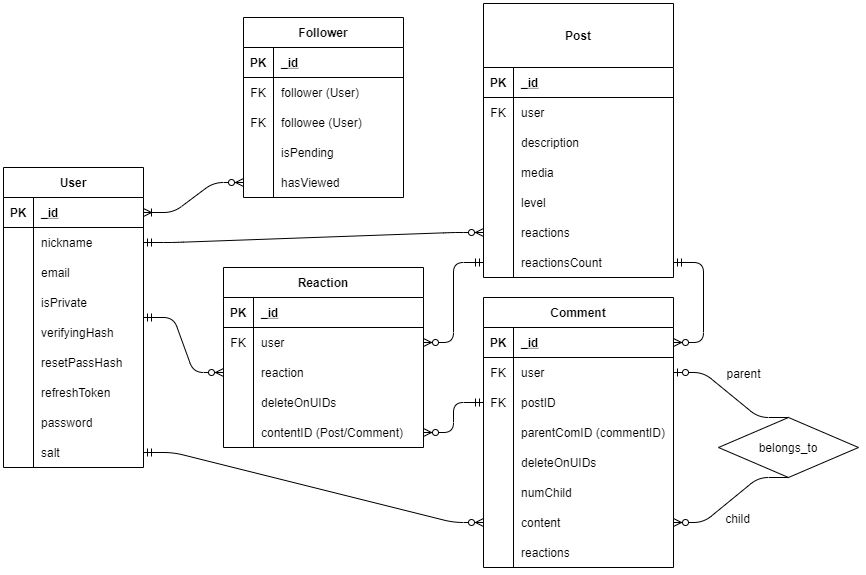

# tSNS

[frontend code](https://github.com/jjw2995/tsns-front)

### NOTE 1

Using free dyno on Heroku which goes to sleep after 30 minutes, initial cold startup causes "applicatio error" as app takes time to start

Once you see the error message "applicatio error" refresh the page to see the website

[deployed frontend - for end users to see](https://tsns-front.herokuapp.com/)


### NOTE 2

this backend has code that is paired to my frontend so it will be unusable unless you change the urls sent to the users by these functions ( setupPassReset & sendVerificationEmail ) @ backend/services/service-auth.js

```js
  async setupPassReset(email) {
    let hash = crypto.randomBytes(20).toString("hex");
    let user = await this.User.findOneAndUpdate(
      { email: email },
      { resetPassHash: hash }
    );
    if (!user) {
      throw Error("user does not exist, register");
    }
    mailer.sendMail(
      email,
      "click the link below to reset password",
      // change below url
      `${process.env.FRONTEND_BASE_URL}/reset-password/${user._id}/${hash}`,
      "Click Me to Reset Password"
    );
    return;
  }

  function sendVerificationEmail(email, uid, vhash) {
    mailer.sendMail(
      email,
      "click the link below to verify",
      // change below url
      `${process.env.FRONTEND_BASE_URL}/${uid}/${vhash}`,
      "Click Me to Verify"
    );
  }
```

## Watered Down Entity Relationship

**note - parent/child comment relationship is not recursive (only one level deep)**



## Backend Setup

environment variables

```
REFRESH_TOKEN_SECRET = private string to hash token
ACCESS_TOKEN_SECRET = private string to hash token

DB_URI = mongoDB instance uri (I used mongoDB Atlas)

EMAIL = email to send users email
EMAIL_PASSWORD = password of that email

BASE_URL = backend server base_url
FRONTEND_BASE_URL = frontend server base_url
```

**also don't forget**

```
google-credential.json
```

downloaded from google cloud storage and placed at the root (above folder backend)

## Start Server with

```
npm start
```

## API

### [full API documentation](https://app.swaggerhub.com/apis/jjw2995/tSNS_API/1.0.0#/auth)


How to use simulated OAuth2 on my backend may be vague, so here's an example using Axios

```js
// after login, set header with given accessToken
let headers = {
  "Authorization": `Bearer ${your accessToken}`
  }

axios({headers}).get("/api/endpoints")
  .then(...)
  .catch(...)
```

if accessToken expires, request token refresh as following

```js
// refreshToken from login
let payload = {"refreshToken": "eyJhbGciOiJIUzI1NiIsInR5..."}

axios().post("/api/token", payload)
  .then((r)=>{
    // returns new set of tokens if refreshToken is valid
    let {refreshToken, accessToken} = r
  })
  .catch(...)
```

<br/>

POST post request on API doc may be vague, so here's an example using Axios

```js
// example code of post post request using formdata, with Axios
let {level, description, images} = your input

let formData = new FormData();

formData.set("level", level);
formData.set("description", description);

// just set individual images to formdata with any name
images.forEach((r, i) => {
  formData.set(`${i}`, r);
});

let headers = {
  "Content-Type":"multipart/form-data",
  "Authorization": `Bearer ${your accessToken}`
  }

axios({headers}).post("/api/posts", formData)
  .then(...)
  .catch(...)
```

## Ending Remarks

While the backend code was initially developed agile & tested end to end, I stopped going agile when I started coding with frontend and tests are now out of date.

I'll come back to it later to update the tests and do minor API doc update but it has to suffice for now.

Doing this project, I've learned that having Minimum Viable Product fast and iterating on that is way easier than agonizing over details of things with no code. Also having concrete frontend layout plans to not comtemplate when making a API decision was important.

<!-- ## Authorization

| Status Code | Description             |
| :---------- | :---------------------- |
| 200         | `OK`                    |
| 201         | `CREATED`               |
| 400         | `BAD REQUEST`           |
| 404         | `NOT FOUND`             |
| 500         | `INTERNAL SERVER ERROR` | -->
